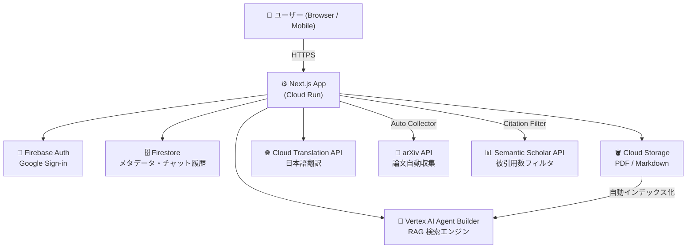

# 🌙 Tsukineko Grimoire（月ねこグリモワール）

> 知識を貪り、創造の魔法を紡ぐ、自分専用の魔導書

AI・機械学習論文を自動収集し、日本語で検索・質問できる RAG ベースの知識管理アプリ。  
Google Cloud "Trial credit for GenAI App Builder" ($1,000) を活用。

---

## ✨ 主な機能

| 機能 | 説明 |
|------|------|
| 🔮 **Grimoire（チャット）** | arXiv 論文を元に日本語で質問・回答（RAG） |
| 📚 **Archive（書庫）** | 収集済み論文の一覧表示・カテゴリ絞り込み・検索 |
| ⬆️ **Upload（取り込み）** | PDF・Markdown を手動アップロード |
| 🛰️ **Auto Collector** | arXiv から AI/ML 論文を自動収集（被引用数フィルタ付き） |
| 🌐 **日本語翻訳** | abstract を自動で日本語翻訳して保存 |
| 📄 **PDF→Markdown 変換** | 検索精度向上のため PDF をメタデータ注入型 Markdown に変換 |

---

## 🏗️ システム構成



---

## 🛠️ Tech Stack

| 分類 | 技術 |
|------|------|
| **Frontend** | Next.js 14, TypeScript, Tailwind CSS, Framer Motion |
| **AI エンジン** | Vertex AI Agent Builder (`@google-cloud/discoveryengine`) |
| **認証** | Firebase Authentication（Google Sign-in + Session Cookie） |
| **データベース** | Firestore |
| **ストレージ** | Google Cloud Storage |
| **翻訳** | Cloud Translation API v2 |
| **論文情報** | arXiv API, Semantic Scholar API |
| **デプロイ** | Google Cloud Run |

---

## 🚀 セットアップ

### 1. 環境変数の設定

```bash
cp .env.example .env.local
# .env.local に各値を設定
```

### 2. Firebase の設定

1. [Firebase Console](https://console.firebase.google.com/) でプロジェクトを作成
2. Authentication → Google Sign-in を有効化
3. Firestore Database を作成（本番モード）
4. Web アプリを追加して設定値を `.env.local` に記載

### 3. Google Cloud の設定

```bash
# API の有効化
gcloud services enable \
  discoveryengine.googleapis.com \
  storage.googleapis.com \
  firestore.googleapis.com \
  translate.googleapis.com

# GCS バケット作成
gsutil mb -l asia-northeast1 gs://<your-bucket-name>

# サービスアカウント作成 & キー取得
gcloud iam service-accounts create grimoire-sa
gcloud projects add-iam-policy-binding <PROJECT_ID> \
  --member="serviceAccount:grimoire-sa@<PROJECT_ID>.iam.gserviceaccount.com" \
  --role="roles/owner"
gcloud iam service-accounts keys create keys/sa.json \
  --iam-account=grimoire-sa@<PROJECT_ID>.iam.gserviceaccount.com
```

### 4. Vertex AI Agent Builder の設定

1. [Agent Builder コンソール](https://console.cloud.google.com/gen-app-builder/engines) を開く
2. **Data Store** を作成（Type: Cloud Storage, Location: **global**）
3. 作成した GCS バケットを Data Store に接続
4. **Search App** を作成して Data Store を紐付け
5. Engine ID と Data Store ID を `.env.local` に記載（短い ID のみ）

### 5. 開発サーバーの起動

```bash
npm install

# macOS でファイル監視エラーが出る場合
WATCHPACK_POLLING=true npm run dev -- --port 3002
```

---

## 📖 API Routes

| エンドポイント | メソッド | 説明 |
|--------------|---------|------|
| `/api/chat` | POST | RAG チャット（Agent Builder 検索） |
| `/api/ingest` | POST | ファイルアップロード（PDF/Markdown） |
| `/api/collector` | POST | arXiv 論文自動収集 |
| `/api/admin/sync-status` | POST | Agent Builder インデックス状態を同期 |
| `/api/admin/reindex` | POST | 既存 PDF を Markdown に変換して再インデックス |
| `/api/auth/session` | POST/DELETE | セッション Cookie の発行・削除 |

管理系 API は `Authorization: Bearer <CRON_SECRET>` が必要です。

---

## 🗃️ データ収集

### 厳選論文リストから収集（推奨）

```bash
# タブ①: 開発サーバー起動
WATCHPACK_POLLING=true npm run dev -- --port 3002

# タブ②: 厳選論文を収集
bash scripts/curated-papers.sh 3002
```

`scripts/curated-ids.csv` に arXiv ID・タイトル・カテゴリが記載されており、67件の重要論文を直接 ID 指定で取得します。

### キーワードバッチ収集（被引用数フィルタ付き）

```bash
bash scripts/collect-papers.sh 3002
```

`MIN_CITATION_COUNT=50`（`.env.local`）未満の論文は自動スキップされます。

### Agent Builder インデックス更新

```bash
# 論文収集後（インデックス化に最大 48 時間かかります）
curl -X POST http://localhost:3002/api/admin/sync-status \
  -H "Authorization: Bearer local-dev-secret"
```

### 既存 PDF を Markdown に変換（検索精度向上）

```bash
for i in {1..8}; do
  curl -s -X POST http://localhost:3002/api/admin/reindex \
    -H "Authorization: Bearer local-dev-secret" \
    -H "Content-Type: application/json" \
    -d '{"limit": 10}'
  sleep 3
done
```

---

## 📁 プロジェクト構成

```
tsukineko-grimoire/
├── app/
│   ├── (auth)/login/           # ログインページ
│   ├── (main)/
│   │   ├── grimoire/           # RAG チャット画面
│   │   ├── archive/            # 書庫（論文一覧・検索）
│   │   │   └── upload/         # アップロードページ
│   │   └── settings/           # 設定ページ
│   └── api/
│       ├── chat/               # RAG チャット API
│       ├── ingest/             # ファイルアップロード API
│       ├── collector/          # arXiv 自動収集 API
│       ├── admin/
│       │   ├── sync-status/    # インデックス状態同期
│       │   └── reindex/        # PDF→Markdown 再変換
│       └── auth/session/       # 認証セッション
├── components/
│   ├── features/
│   │   ├── archive-library.tsx # 書庫コンポーネント
│   │   └── file-uploader.tsx   # アップロードコンポーネント
│   └── main-nav.tsx            # ナビゲーション（モバイル対応）
├── lib/
│   ├── firebase-admin.ts       # Firebase Admin SDK
│   ├── firebase.ts             # Firebase Client SDK
│   ├── auth-helpers.ts         # 認証ヘルパー
│   ├── vertex-discovery.ts     # Agent Builder クライアント（シングルトン）
│   ├── translate.ts            # Cloud Translation API（JA↔EN）
│   ├── pdf-to-markdown.ts      # PDF→Markdown 変換
│   ├── semantic-scholar.ts     # 被引用数取得
│   └── query-cache.ts          # クエリキャッシュ
├── scripts/
│   ├── curated-ids.csv         # 厳選論文 ID リスト（67件）
│   ├── curated-papers.sh       # 厳選論文収集スクリプト
│   └── collect-papers.sh       # キーワードバッチ収集スクリプト
├── middleware.ts                # 認証ミドルウェア
├── Dockerfile                  # Cloud Run 用
└── PRD.md                      # 完全仕様書
```

---

## 🚢 Cloud Run へのデプロイ

```bash
# Docker イメージをビルドして push
gcloud builds submit --tag gcr.io/<PROJECT_ID>/tsukineko-grimoire

# Cloud Run にデプロイ
gcloud run deploy tsukineko-grimoire \
  --image gcr.io/<PROJECT_ID>/tsukineko-grimoire \
  --region asia-northeast1 \
  --platform managed \
  --allow-unauthenticated \
  --set-env-vars "GOOGLE_CLOUD_PROJECT_ID=<PROJECT_ID>,..." \
  --set-secrets "FIREBASE_PRIVATE_KEY=firebase-private-key:latest"
```

シークレット類は [Secret Manager](https://console.cloud.google.com/security/secret-manager) で管理することを推奨します。

---

## ⚠️ 重要な制約

このプロジェクトは **Vertex AI Agent Builder（Discovery Engine API）のみ** を AI エンジンとして使用します。

```typescript
// ✅ 使用可
import { SearchServiceClient } from '@google-cloud/discoveryengine';

// ❌ 使用禁止（高額請求の原因になる）
import { VertexAI } from '@google-cloud/vertexai';
```

詳細は `.cursorrules` および `PRD.md` を参照してください。
